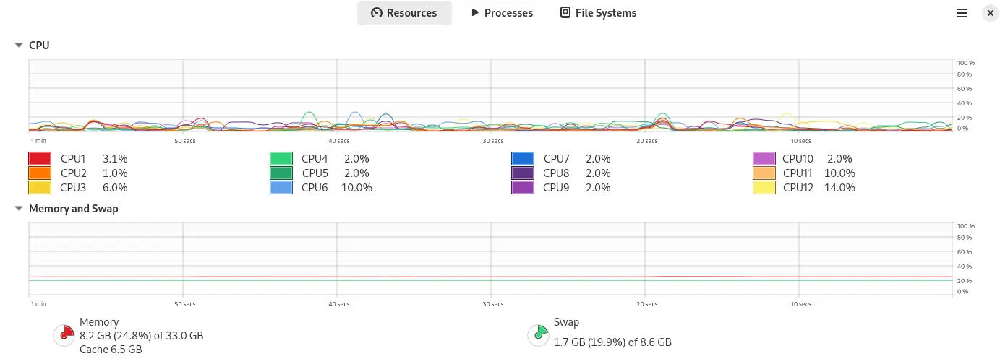
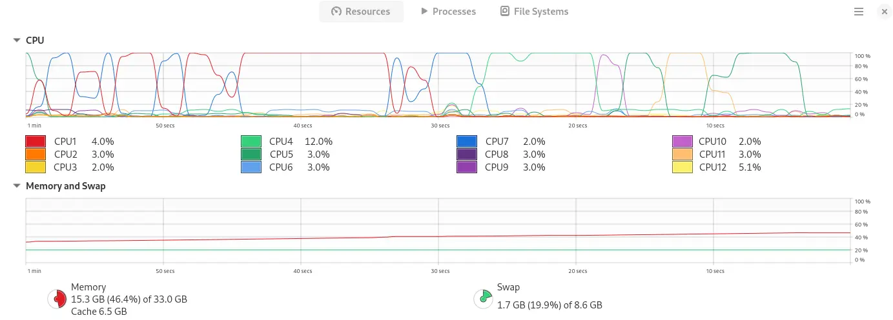
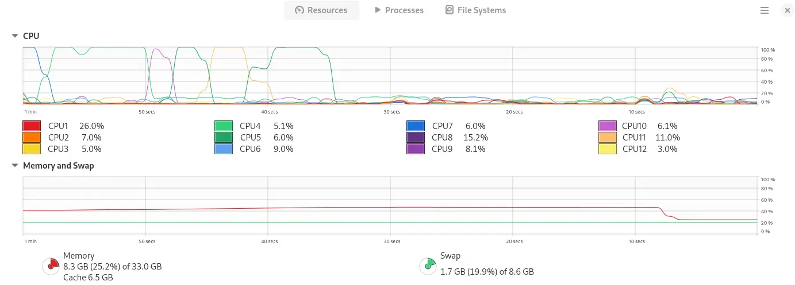

# Atoms

The maximal number of atoms in Erlang virtual machine is limited to `1048576`.
This can be changed using `+t` parameter, like this:

```shell
$ erl +t 800000000
```

Let's check, how Erlang behaves when we create, let say 80M atoms.

```text
$ erl +t 800000000
Erlang/OTP 26 [erts-14.2.5.4] [source] [64-bit] [smp:12:12] [ds:12:12:10] [async-threads:1] [jit:ns]

Eshell V14.2.5.4 (press Ctrl+G to abort, type help(). for help)
1> c(atomicus).
{ok,atomicus}
2> atomicus:start(80000000).
System time: 72328 [ms], wall time: 75646 [ms]
ok
3> q().
ok
```
Status of the system before starting the test:



Status of the system after allocating `80_000_000` atoms. Memory is not freed. Atoms are not garbage collected.



Status of the system after stopping Erlang VM. Memory if freed.



## Why this example?

Assuming, that a single smart contract written in Erlang could be a single module that exports
some entrypoints like `instantiate`, `execute`, `query`, `migrate`, `admin` and similar.
Assuming, that such module would be loaded by generic server that would be responsible for
executing those entrypoints, and based on the same source code (module) multiple processes
could be started simultanously.
Knowing, that a module name is an atom in Erlang, the question is, how many single modules
(smart contracts) can be compiled and loaded to Erlang VM. Without starting processes yet.
Just having the source code compiled and ready to be started by the generic server?

This test shows that having 80M atoms in memory takes about 7,1GB that is not garbage collected.
What about additionally compiled source code... 
