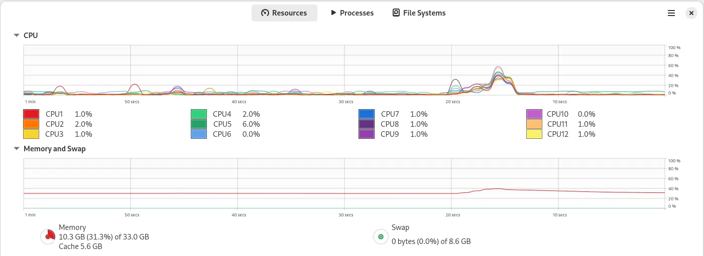

# Processes are cheap in Erlang

This is a refined example taken from the book "Programming Erlang" Second Edition written by Joe Armstrong pp.189-191. 

The source code is in file [processes.erl](./processes.erl).

## System used for testing

Hardware Information:
- **Memory:** 32.0 GiB
- **Processor:** AMD Ryzen™ 5 4600G with Radeon™ Graphics × 12
- **Graphics:** AMD Radeon™ Graphics
- **Disk Capacity:** 1.5 TB

Software Information:
- **OS Name:** Fedora Linux 41 (Workstation Edition)
- **OS Type:** 64-bit
- **GNOME Version:** 47
- **Windowing System:** Wayland
- **Kernel Version:** Linux 6.11.10-300.fc41.x86_64

## Testing and results

> **6.12.2024** Santa comes to believers.

### TEST 1: starting 200k processes

Erlang VM is started with the default settings, where the maximum number of processes is **262144**.

```text
$ erl
Erlang/OTP 26 [erts-14.2.5.4] [source] [64-bit] [smp:12:12] [ds:12:12:10] [async-threads:1] [jit:ns]

Eshell V14.2.5.4 (press Ctrl+G to abort, type help(). for help)
1> 1> c(processes).
{ok,processes} 
2> processes:max(200000).
Maximum allowed processes: 262144
Requested number of processes: 200000
Process spawn time: 1.96 [µs], wall time: 2.405 [µs]
Total time: 392 [ms], wall time: 481 [ms]
ok
3>
```


### TEST 2: starting 1M processes

Erlang VM is started with the maximum number of processes equal to 10 millions.
See [System Limits](https://www.erlang.org/doc/system/system_limits.html) for details.

```text
$ erl +P 10000000
Erlang/OTP 26 [erts-14.2.5.4] [source] [64-bit] [smp:12:12] [ds:12:12:10] [async-threads:1] [jit:ns]

Eshell V14.2.5.4 (press Ctrl+G to abort, type help(). for help)
1> c(processes).
{ok,processes}
2> processes:max(1000000).
Maximum allowed processes: 16777216
Requested number of processes: 1000000
Process spawn time: 2.253 [µs], wall time: 2.951 [µs]
Total time: 2253 [ms], wall time: 2951 [ms]
ok
3>
```



### TEST 3: starting 5M processes

Erlang VM is started with the maximum number of processes equal to 10 millions.

```text
$ erl +P 10000000
Erlang/OTP 26 [erts-14.2.5.4] [source] [64-bit] [smp:12:12] [ds:12:12:10] [async-threads:1] [jit:ns]

Eshell V14.2.5.4 (press Ctrl+G to abort, type help(). for help)
1> c(processes).
{ok,processes}
2> processes:max(5000000).
Maximum allowed processes: 16777216
Requested number of processes: 5000000
Process spawn time: 2.5182 [µs], wall time: 3.4784 [µs]
Total time: 12591 [ms], wall time: 17392 [ms]
ok
3>
```


### TEST 4: starting 10M processes

Erlang VM is started with the maximum number of processes equal to 10 millions.

```text
$ erl +P 10000000
Erlang/OTP 26 [erts-14.2.5.4] [source] [64-bit] [smp:12:12] [ds:12:12:10] [async-threads:1] [jit:ns]

Eshell V14.2.5.4 (press Ctrl+G to abort, type help(). for help)
1> c(processes).
{ok,processes}
2> processes:max(10000000).
Maximum allowed processes: 16777216
Requested number of processes: 10000000
Process spawn time: 2.7994 [µs], wall time: 4.2026 [µs]
Total time: 27994 [ms], wall time: 42026 [ms]
ok
3>
```


### Summary

| Number of processes | Process spawn system time | Process spawn wall time | Total system time | Total wall time |
|--------------------:|--------------------------:|------------------------:|------------------:|----------------:|
|             200_000 |                   1.96 µs |                 2.41 µs |            0.39 s |          0.48 s | 
|           1_000_000 |                   2.25 µs |                 2.95 µs |            2.25 s |          2.95 s |
|           5_000_000 |                   2.52 µs |                 3.48 µs |           12.59 s |         17.39 s |
|          10_000_000 |                   2.80 µs |                 4.20 µs |           27.99 s |         42.03 s |

Spawning a single process takes about 3µs, no matter how many of them are spawned.
The Erlang VM did not crash, even for 10M processes, where the operating system started to swap the memory.

Speculation:

> It should be possible to run simultanously millions of smart contracts implemented as Erlang processes 
> on the single node (hardware) having only 64GB memory, without memory swapping.
> 
> Assuming, that in one moment in time, not all smart contract have to be loaded into memory
> (only some of them could be "pinned"), I speculate, that a single node could handle hundreds
> of millions of smart contract instances.
> 
> Having a single blockchain node and multiple Erlang nodes running smart contracts,
> a single blockchain node could handle billions of smart contracts.
> 
> **This solution simply scales.**

🚀
